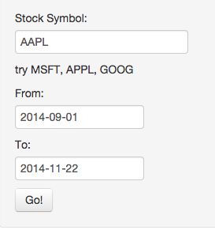

Reactive Stock Screener
========================================================
author: Roman Lukerin
date: 2014-11-22

https://look.shinyapps.io/StockScreener/

Developing Data Products: Course Project

Introduction
========================================================

Reactive Stock screener displays stock details: 

- Data soursce is from google www.google.com/finance and yahoo finance.yahoo.com
- Displays Candlestick Chart
- Displays Annual Balance Sheet

Data Source
========================================================

Project uses [`quantmod` packages] (http://cran.r-project.org/web/packages/quantmod/index.html) to download data:

```r
library(quantmod)
getSymbols("AAPL")
```

```
[1] "AAPL"
```

```r
head(AAPL)
```

```
           AAPL.Open AAPL.High AAPL.Low AAPL.Close AAPL.Volume
2007-01-03     86.29     86.58    81.90      83.80   309579900
2007-01-04     84.05     85.95    83.82      85.66   211815100
2007-01-05     85.77     86.20    84.40      85.05   208685400
2007-01-08     85.96     86.53    85.28      85.47   199276700
2007-01-09     86.45     92.98    85.15      92.57   837324600
2007-01-10     94.75     97.80    93.45      97.00   738220000
           AAPL.Adjusted
2007-01-03         11.34
2007-01-04         11.59
2007-01-05         11.51
2007-01-08         11.56
2007-01-09         12.52
2007-01-10         13.12
```

User guide
========================================================

User interface is very simple. Just type stock symbol and choose From and To dates



App will be executed automaticly. Button `Go!` could be used for reloading.

Source Code
=========================================================

Package used:

- shiny
- quantmod

Source code located
